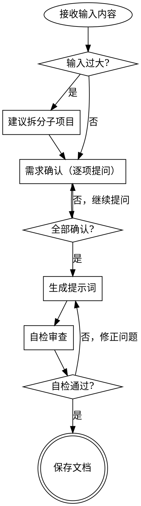

# AI 漫画/漫画视频提示词生成

通过六维提示词框架，将小说文本、剧本或不完整提示词转化为结构化的 AI 视频/漫画提示词。

<HARD-GATE>
在完成交互式需求确认流程之前，绝不生成任何提示词。无论输入内容多么简单，都必须先完成需求确认。
</HARD-GATE>

## 需求确认清单

你 MUST 为以下每一项创建 TodoWrite 任务，并按顺序完成：

1. **分析输入内容** — 篇幅、题材、角色、场景、冲突点
2. **确认目标 AI 工具** — Seedance 2.0、即梦AI、可灵、Runway、Pika 等
3. **确认视频风格** — 2D 动漫、3D 写实、电影感、中国水墨、赛博朋克等
4. **确认视频参数** — 时长、画幅比（16:9/9:16/1:1）、分辨率
5. **确认角色一致性策略** — 三视图、参考图、文字描述
6. **确认场景一致性策略** — 四视图、单图、文字描述
7. **确认输出格式** — 分镜表、故事板图像、纯提示词文本
8. **输入过大时建议拆分子项目** — 多子系统需独立拆分，各自走完整流程

每次只问一个问题。优先使用选择题，开放性问题亦可。所有确认完成后方可进入生成阶段。

## 流程图



## 六维提示词框架

每个镜头的提示词 MUST 覆盖以下六个维度，缺一不可：

### 1. 确定绝对主体

优先描述主体的动作与状态，避免背景元素抢夺注意力。

```
❌ 一座城市，一个女孩站在街角
✅ 一个穿校服的女孩站在街角，双手紧握书包带
```

### 2. 锚定核心动作

核心动作 + 辅助动作分层，避免多个动作互相竞争。

```
❌ 她跑着跳起来转身挥手
✅ 核心动作：向前奔跑；辅助动作：衣摆随跑动飘起
```

### 3. 界定画面边界

弱化背景物件，协调交互物件，防止无差别抢夺注意力。

```
❌ 桌上有电脑、咖啡杯、文件、手机、台灯、花瓶
✅ 桌上有电脑（主体交互物件），其余物品虚化处理
```

### 4. 规划镜头调度

镜头始终跟随主体，给出精确的镜头运动指令。

```
❌ 镜头移动
✅ 中景，镜头从右侧缓慢横移跟随角色行走，速度与角色同步
```

参考 ./camera-movements.md 获取镜头运动词汇表。

### 5. 设定光影色彩

以主体情绪为中心，匹配场景氛围。

```
❌ 光线很好
✅ 暖色调侧光，从画面左侧45度照射，角色面部半明半暗，营造犹豫氛围
```

参考 ./emotion-expressions.md 获取情绪与真实感技巧。

### 6. 把控时间节奏

秒级状态演变规划，避免 AI 随机行为。

```
❌ 她慢慢转身
✅ 0-2秒：角色正面中景静止；2-4秒：头部缓慢右转，目光跟随移动物体；4-5秒：身体跟随转动，镜头同步微移
```

## 剧本→分镜转换流程

### 小说→剧本

标准剧本格式：

| 字段 | 说明 |
|------|------|
| 场景 | 地点 + 时间 + 内外景 |
| 对白 | 角色名 + 台词 |
| 镜头 | 镜头类型与运动 |
| 叙述 | 画面描述与动作 |

### 剧本→分镜表

| 字段 | 说明 |
|------|------|
| 镜号 | 顺序编号 |
| 景别 | 远景/全景/中景/近景/特写 |
| 镜头运动 | 推/拉/摇/移/跟/升/降 |
| 角色动作 | 具体动作描述 |
| 时间线 | 起止秒数 |
| 音频/对白 | 配合的声音内容 |

### 分镜→视频提示词

使用六维框架逐镜展开，每条提示词 MUST 完整覆盖六个维度。

参考 ./prompt-formulas.md 获取提示词模板。

## 角色一致性提示词

每个角色 MUST 独立定义，多角色场景中通过角色名引用。

### 角色定义表

| 维度 | 内容 |
|------|------|
| 身份 | 姓名、角色定位、性格特征 |
| 外貌 | 脸型、发型、肤色、体型 |
| 服装 | 风格、颜色、材质、配饰 |
| 标志动作/表情 | 该角色最具辨识度的动作或表情 |

### 三视图生成提示词

```
正面视图：[角色名]，正面站立，双手自然下垂，中性表情，白色背景
侧面视图：[角色名]，侧面站立，身体朝右，白色背景
背面视图：[角色名]，背面站立，白色背景
```

### 多角色场景规则

- 每个角色独立定义，绝不混合引用
- 场景提示词中使用角色名指代，不重复外貌描述
- 示例：`林月和陈风站在天台上`，而非 `一个黑发女孩和一个棕发男孩站在天台上`

## 场景一致性提示词

### 场景定义表

| 维度 | 内容 |
|------|------|
| 场景名称 | 唯一标识名 |
| 场景描述 | 空间布局、关键物件、氛围 |
| 光照条件 | 光源类型、方向、色温 |
| 色调氛围 | 主色调、情绪基调 |
| 角色空间位置 | 角色在场景中的站位与移动范围 |

### 四视图提示词（室内场景）

```
正面视图：[场景名]，从入口方向看向室内，展示整体布局
左侧视图：[场景名]，从左侧墙面方向看向室内
右侧视图：[场景名]，从右侧墙面方向看向室内
俯视图：[场景名]，从上方俯瞰，展示家具摆放与空间关系
```

### 单图提示词（宏观场景）

```
[场景名]，广角全景，展示完整空间，[光照]氛围，[色调]色调
```

## 输出文档格式

保存路径：`docs/ai-comic-prompts/YYYY-MM-DD-<项目名>.md`

### 文档结构

```
1. 项目概览
   - 原作信息、目标工具、视频风格、参数设定

2. 角色设定表
   - 每个角色的完整定义（身份/外貌/服装/标志动作）
   - 三视图提示词

3. 场景设定表
   - 每个场景的完整定义（名称/描述/光照/色调/空间位置）
   - 四视图或单图提示词

4. 分镜提示词表
   - 镜号 | 景别 | 镜头运动 | 六维提示词 | 时间线 | 音频/对白

5. 故事板提示词（可选）
   - 整合分镜为连续叙事提示词

6. 负面提示词汇总
   - 通用负面提示词
   - 场景专属负面提示词

7. 合规替换记录
   - 原始用语 → 替换用语
```

参考 ./compliance-guide.md 获取敏感词替换规则。

## 自检清单

输出前 MUST 逐项检查：

| 检查项 | 要求 |
|--------|------|
| 占位符扫描 | 无 TBD、TODO、待补充等占位文本 |
| 一致性检查 | 角色名、场景描述全文统一，无矛盾 |
| 完整性检查 | 每个镜头均有六维描述，无遗漏维度 |
| 合规性检查 | 敏感词已替换，无遗漏 |
| 格式检查 | 符合目标工具的提示词格式要求 |

自检不通过则返回修正，修正后重新自检，直至全部通过。

## Red Flags — 绝不做的事

- **未确认需求就生成提示词** — 无论输入多简单，必须先完成需求确认
- **跳过六维框架任一维度** — 每个镜头六个维度缺一不可
- **混合角色引用** — 始终使用定义的角色名，绝不内联外貌描述
- **遗漏负面提示词** — 每个项目必须有负面提示词汇总
- **跳过合规检查** — 敏感词替换是硬性要求
- **允许背景元素抢夺主体注意力** — 主体永远是画面焦点

## 与其他技能的集成

- **superpowers:ai-voice-prompt** — 分镜包含对白/旁白时使用
- **./prompt-formulas.md** — 提示词模板参考
- **./camera-movements.md** — 镜头运动词汇表
- **./emotion-expressions.md** — 情绪与真实感技巧
- **./compliance-guide.md** — 敏感词替换规则
