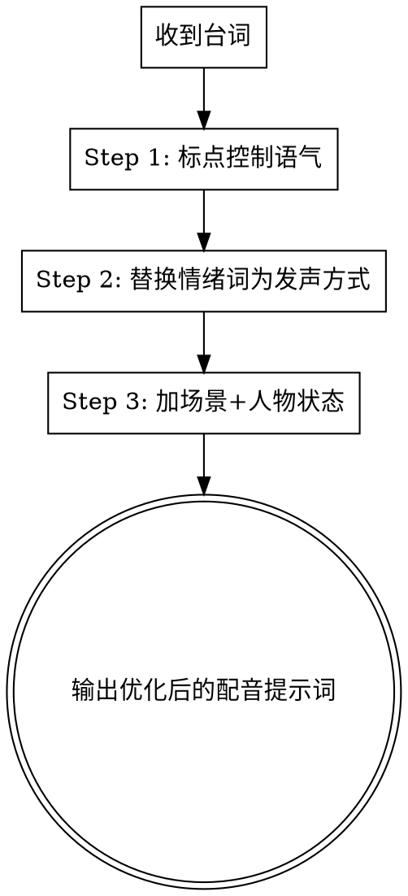

# AI 配音情绪优化

## Overview

AI 配音听起来像机器人，因为提示词缺乏情绪控制。直接给 AI 一句台词，它只会机械地念出来。

**核心原则：** 通过标点控制语气 + 发声方式描述 + 场景人物状态，三步实现演员级真实感。

## 三步法

### Step 1: 用标点控制语气

标点符号是告诉 AI 用什么语气的最快方式：

| 标点 | 效果 |
|------|------|
| 问号(?) | 疑问/不确定/反问感 |
| 感叹号(!) | 强调/愤怒/警告/激动感 |
| 逗号(,) | 停顿/思考/犹豫感 |
| 省略号(...) | 犹豫/拖长/未尽之意 |
| 破折号(——) | 突然转折/强调后半句 |
| 句号(。) | 陈述/肯定/结束感 |

**对比示例：**

- 无标点：你是不是也想我呀 → 平淡，机械
- 加问号：你是不是也想我呀？ → 带情绪，疑问感
- 加感叹号：你是不是也想我呀！ → 激动，强调

### Step 2: 别写情绪写发声方式

永远不要写抽象情绪词如"紧张地说"或"温柔地说"。描述声音听起来是什么样的。

**通用公式：语气 = 声音大小 + 语速快慢 + 停顿位置 + 尾音变化**

| 错误写法 | 正确写法 |
|---------|---------|
| 紧张地说 | 声音发紧，语速加快，呼吸急促地说 |
| 温柔地说 | 声音放轻，语速放慢，尾音微微下沉地说 |
| 怀疑地说 | 语速放慢，声音压低，最后几个字微微上扬地说 |
| 愤怒地说 | 声音加大，咬字变重，一字一句地说 |
| 害怕地说 | 声音发颤，断断续续，尾音发虚地说 |

### Step 3: 加场景和人物状态

**公式：场景 + 人物状态 + 发声方式 + 台词**

同一句台词，不同场景完全不同：

**"你终于来了"（等待，委屈）：**
他一个人在雨里等了很久，声音有点发颤，语速慢下来，像是忍了很久才开口说：你终于来了

**"你终于来了"（反派，冷笑）：**
他站在昏暗的房间里，声音压低，语速很慢，最后几个字带着冷笑说：你终于来了

**"他好像还没走"（躲藏，害怕）：**
他躲在门后，害怕被发现，声音压得很低，气息很轻，断断续续地说：他好像还没走

**"所以从一开始你就在骗我"（愤怒，被背叛）：**
他刚刚得知真相，情绪快要失控，声音压着怒气，咬字变重，一字一句地说：所以，从一开始，你就在骗我

## Process Flow

## Quick Reference

| 情绪 | 标点 | 声音大小 | 语速 | 停顿 | 尾音 |
|------|------|---------|------|------|------|
| 愤怒 | ！ | 声音加大 | 语速加快 | 咬字加重 | 尾音收住 |
| 难过 | ... | 声音放轻 | 语速放慢 | 句末停顿 | 尾音发虚 |
| 开心 | ！ | 声音明亮 | 语速轻快 | 无明显停顿 | 尾音上扬 |
| 恐惧 | ... | 声音发颤 | 语速不稳 | 断断续续 | 尾音发虚 |
| 怀疑 | ？ | 声音压低 | 语速放慢 | 关键词前停顿 | 尾音上扬 |
| 思考 | ， | 声音平淡 | 语速放慢 | 中间停顿 | 尾音平缓 |
| 警告 | ！ | 声音压低 | 语速很慢 | 咬字加重 | 尾音收住 |
| 安慰 | ， | 声音放轻 | 语速放慢 | 句末停顿 | 尾音柔和 |

## 与 ai-comic-prompt 联动

当 ai-comic-prompt 技能生成分镜脚本包含台词时，自动调用本技能，用三步法优化配音提示词。

## Red Flags - 永远不要

- 写抽象情绪词（紧张地说、伤心地说等）而不描述发声方式
- 只加标点不加发声方式描述（标点单独不够）
- 跳过场景和人物状态（没有上下文，AI 会机械念词）
- 不同角色使用相同发声方式（每个角色有独特的声音模式）
- 忘记指定尾音变化（尾音是情绪准确度的关键）

## 参考文件

- **`./punctuation-emotion-guide.md`** — 完整标点-情绪映射
- **`./vocal-delivery-methods.md`** — 完整发声方式词汇表
